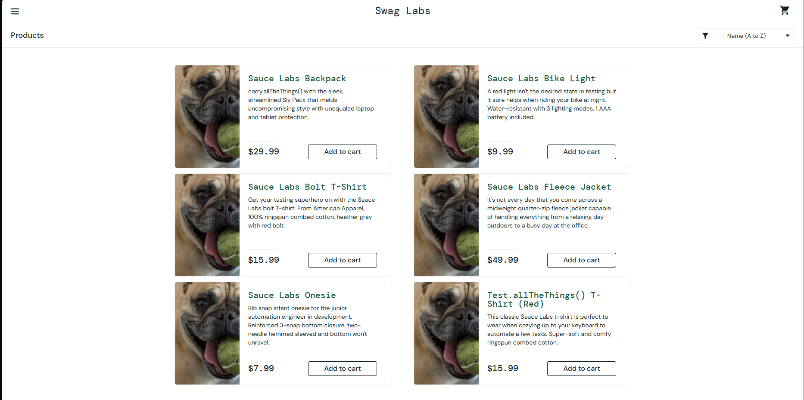
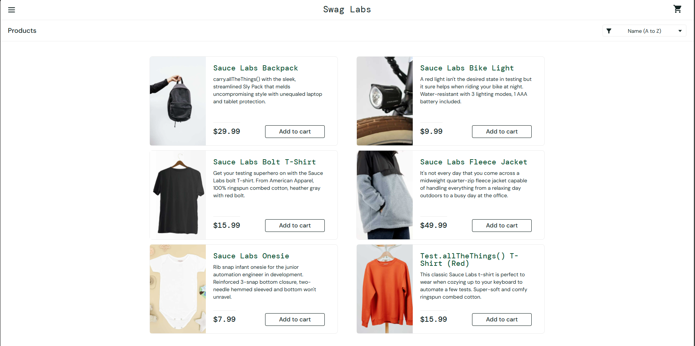

# Bug Report

**Bug ID:** BUG-001

**Title:** Product images are incorrect on the inventory page

**Reported by:** Matvei Kolmakov

**Date:** 07/27/2026

**Environment:** Chrome 126, Windows 11

account: `problem_user`

**Severity:** Medium

**Priority:** High

**Status:** Open

---

## Summary

When logged in as `problem_user`, product images on the inventory (product listing) page do not match their corresponding product names/descriptions. The same mismatch does not occur for `standard_user`.

## Steps to Reproduce

1. Go to https://www.saucedemo.com
2. Log in with username `problem_user` and password `secret_sauce`
3. Observe the product images on the inventory page
4. Compare against the same page logged in as `standard_user`

## Expected Result

Each product image should correctly correspond to its product name and description (e.g. "Sauce Labs Backpack" shows a backpack image).

## Actual Result

All products show the same image regardless of the actual product — e.g. "Sauce Labs Bike Light" and "Sauce Labs Backpack" appear with the same picture, which does not match either product.

## Screenshots

## Additional Notes

- Does **not** occur with `standard_user`, `performance_glitch_user`, or `error_user` — appears specific to `problem_user`.
- Not tested on other browsers, but the issue is front-end data-binding related, so it is likely browser-independent.